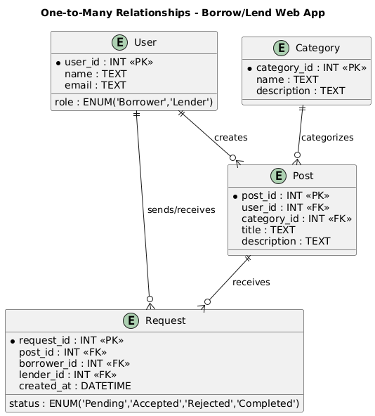
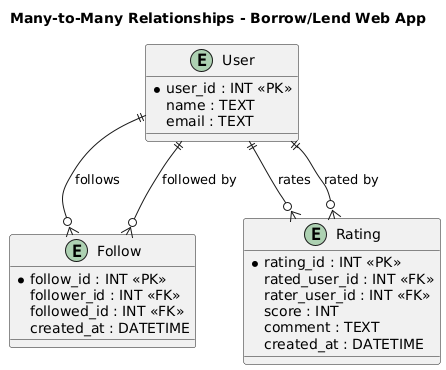

# Entity Relationship Diagram

## Users

| **Column Name** | **Type**                          | **Description**                 |
| --------------- | --------------------------------- | ------------------------------- |
| user_id         | INT (PK)                          | Unique identifier for each user |
| name            | TEXT                              | Full name of the user           |
| email           | TEXT                              | User’s email address            |
| password_hash   | TEXT                              | Encrypted password              |
| role            | TEXT or ENUM('Borrower','Lender') | User type or role               |
| rating          | FLOAT                             | Average rating score            |
| bio             | TEXT                              | Short user bio                  |
| joined_at       | DATETIME                          | Date the account was created    |

## Posts

| **Column Name** | **Type**                                    | **Description**                                         |
| --------------- | ------------------------------------------- | ------------------------------------------------------- |
| post_id         | INT (PK)                                    | Unique ID for the post                                  |
| user_id         | INT (FK → users.user_id)                    | ID of the user who created the post                     |
| category_id     | INT (FK → categories.category_id)           | Associated category                                     |
| title           | TEXT                                        | Post title                                              |
| description     | TEXT                                        | Description of the item or service                      |
| type            | TEXT or ENUM('Borrow Request','Lend Offer') | Identifies if it’s a borrow or lend post                |
| is_available    | BOOLEAN                                     | Indicates if the item or service is currently available |
| created_at      | DATETIME                                    | Date the post was created                               |

## Requests

| **Column Name** | **Type**                                          | **Description**                             |
| --------------- | ------------------------------------------------- | ------------------------------------------- |
| request_id      | INT (PK)                                          | Unique ID for each request                  |
| borrower_id     | INT (FK → users.user_id)                          | User requesting to borrow                   |
| lender_id       | INT (FK → users.user_id)                          | User offering the item or service           |
| post_id         | INT (FK → posts.post_id)                          | Post involved in the transaction            |
| status          | ENUM('Pending','Accepted','Rejected','Completed') | Current request status                      |
| message         | TEXT                                              | Message or note between borrower and lender |
| created_at      | DATETIME                                          | When the request was created                |

## Categories

| **Column Name** | **Type** | **Description**                        |
| --------------- | -------- | -------------------------------------- |
| category_id     | INT (PK) | Unique ID for each category            |
| name            | TEXT     | Category name (e.g., “Books”, “Tools”) |
| description     | TEXT     | Description of the category            |

## Follows

| **Column Name** | **Type**                 | **Description**                  |
| --------------- | ------------------------ | -------------------------------- |
| follow_id       | INT (PK)                 | Unique ID for each follow record |
| follower_id     | INT (FK → users.user_id) | User who follows                 |
| followed_id     | INT (FK → users.user_id) | User being followed              |
| created_at      | DATETIME                 | When the follow began            |

## Ratings

| **Column Name** | **Type**                 | **Description**               |
| --------------- | ------------------------ | ----------------------------- |
| rating_id       | INT (PK)                 | Unique ID for each rating     |
| rated_user_id   | INT (FK → users.user_id) | User being rated              |
| rater_user_id   | INT (FK → users.user_id) | User giving the rating        |
| score           | INT                      | Numeric score (e.g., 1–5)     |
| comment         | TEXT                     | Feedback or review            |
| created_at      | DATETIME                 | When the rating was submitted |

## Relationship Summary

| **Relationship**   | **Type**     | **Description**                                                              |
| ------------------ | ------------ | ---------------------------------------------------------------------------- |
| users → posts      | One-to-Many  | Each user can create many posts, but each post belongs to one user.          |
| categories → posts | One-to-Many  | Each category can include many posts, but each post belongs to one category. |
| posts → requests   | One-to-Many  | Each post can receive many requests, but each request is for one post.       |
| users → requests   | One-to-Many  | Each user can send or receive multiple requests (as borrower or lender).     |
| users ↔ follows    | Many-to-Many | Users can follow many others and be followed by many users.                  |
| users ↔ ratings    | Many-to-Many | Users can rate many others and be rated by many users.                       |

## One-to-Many Relationships

## Many-to-Many Relationships

