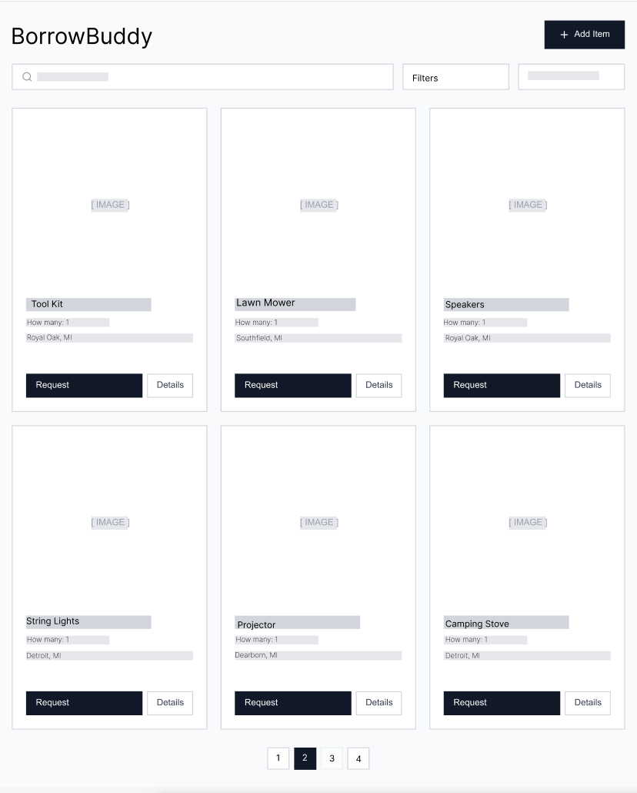
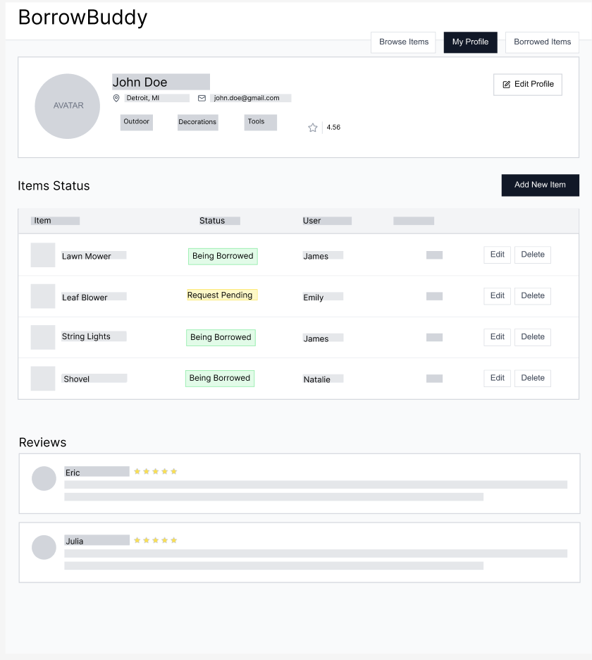
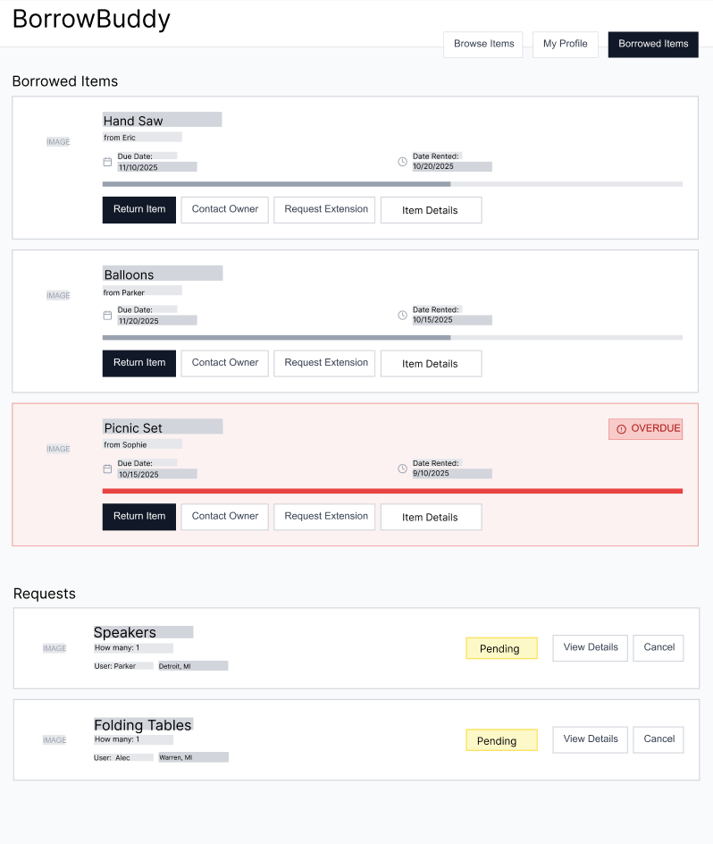

# Wireframes

Reference the Creating an Entity Relationship Diagram final project guide in the course portal for more information about how to complete this deliverable.

## List of Pages

[👉🏾👉🏾👉🏾 List the pages you expect to have in your app, with a ⭐ next to pages you have wireframed]

1. ⭐ Main Page: a list view of the posts 
2. ⭐ Profile Page: a user can see their profile info and items they have lended
3. ⭐ Borrowed Items Page: a user can see the items they are currently borrowing 

## Wireframe 1: Main Page 

## Wireframe 2: Profile Page

## Wireframe 3: Borrowed Items Page

